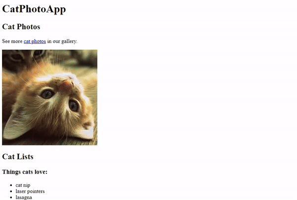

# Cat Photo Site
A site displaying cat photos utilizing href, src, and anchor tags, and other html attributes such as radio field and checkbox forms. HTML practice for FreeCodeCamp ["Responsive Web Design" course](https://www.freecodecamp.org/learn/2022/responsive-web-design/). 

## Future Features
Reformat  the layout of the website to make it more visually appealing and user-friendly, utilize design tools such as Figma. This could include changing the color scheme, adding paralax images, and responsive designs for mobile modular-cards and single page browser views. 

## Existing Prototype Site
